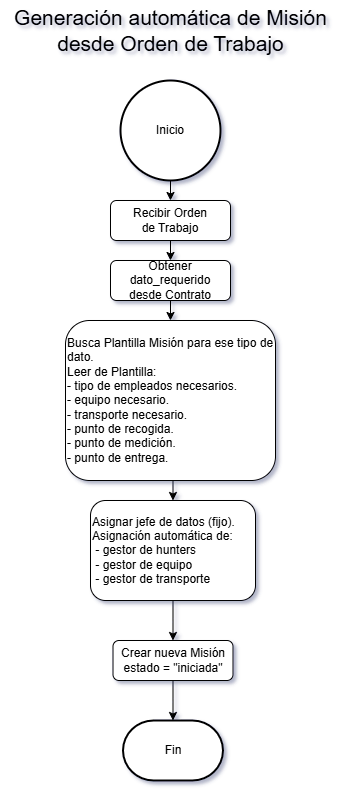
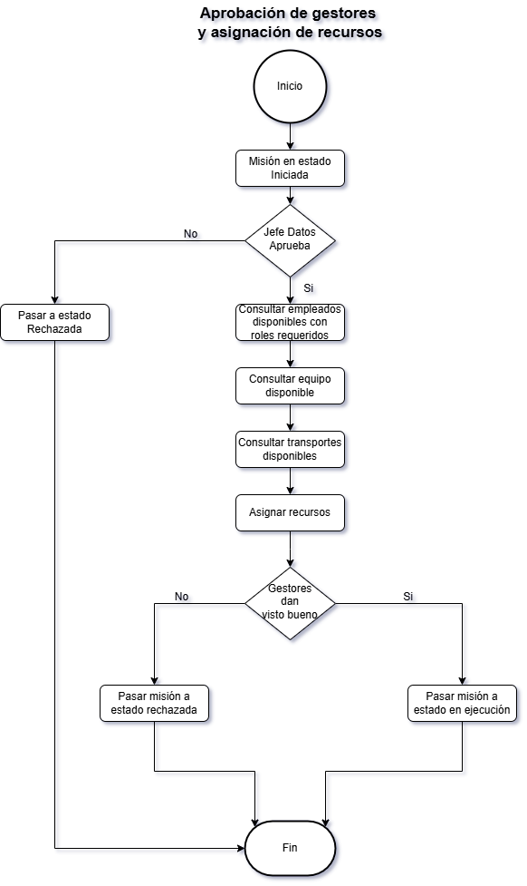
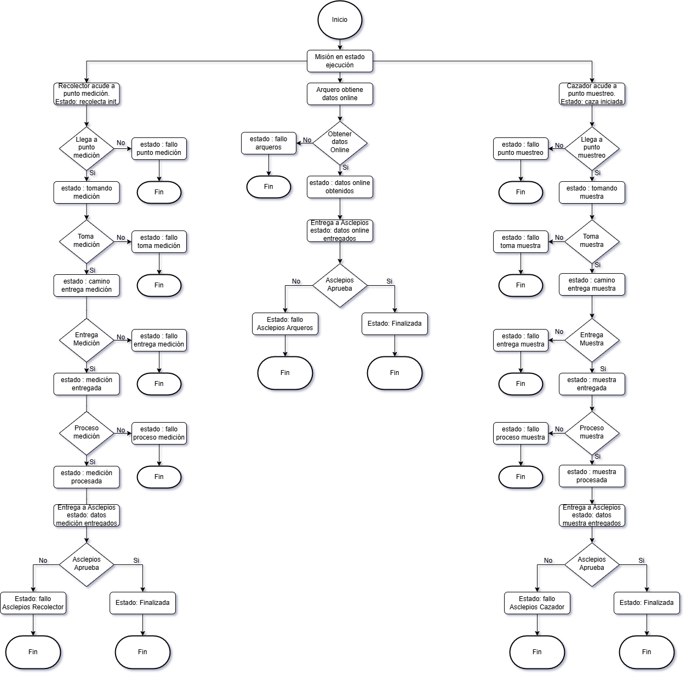

Bienvenido a la documentación oficial del módulo **Malkion**, un sistema de planificación automatizada para la recogida y entrega de datos estructurados en Odoo.

---

# Proyecto Malkion — Fase 4: Planificación del Módulo

**Autor**: David Albi García  
**Fecha**: 07/05/2025  
**Asignatura**: Sistemas de Gestión Empresarial  
**Profesor**: Alfredo Oltra Orengo  

## 🧾 Información general

**Nombre Interno:** `malkion`  
**Nombre Comercial:** *Malkion Data Gathering*

Este módulo gestiona todo el proceso desde la petición de obtención de datos hasta la entrega procesada al cliente en la aplicación *Asclepios*.

Incluye automatización de:

- Contratos y periodicidad  
- Órdenes de trabajo  
- Asignación de gestores y recursos (equipo, transporte, personal)  

---
## Instalación - Fase 5

➡️ [Datos Instalación](install.md)

---

## ⚙️ Funcionalidades

### 1. Gestión de Contratos

- Tipos: estándar y premium  
- Registro y asociación a clientes  
- Control de periodicidad  
- Solicitudes de datos bajo demanda o automáticas  

### 2. Generación de Órdenes de Trabajo

- Desde solicitudes o calendario  
- Autocompletado por plantilla  
- Notificación y aprobación del jefe de gestoría  

### 3. Asignación de Responsables

- Asignación automática y revisión manual de:
  - Gestores de hunters  
  - Equipos  
  - Transporte  

### 4. Asignación de Recursos

- Personal operativo, equipos y transporte según disponibilidad  

### 5. Flujo de Estados de la Misión

- Estados: pendiente, asignada, en curso, entregada, finalizada, estados adicional de fallo en cada etapa

### 6. Inventario

- Gestión de equipos técnicos y vehículos  
- Estados

### 7. Informes

- Misiones, situación del equipo, revisiones de estado de equipo  

---

## 🗺️ Mapa del Módulo

---

## 📦 Dependencias del módulo

El módulo **Malkion Data** se apoya en diversos módulos nativos de Odoo para aprovechar funcionalidades existentes y garantizar una integración fluida con el ecosistema empresarial. Las principales dependencias son:

- `'base'`: núcleo de Odoo, requerido por todos los módulos.
- `'hr'`: modificado para ampliar la gestión de empleados y clasificarlos según su rol operativo (arqueros, cazadores, recolectores, transportistas...).
- `'contacts'`: utilizado para gestionar los datos de clientes y sus contratos asociados.

---

## 🖼️ Wireframes

➡️ [Ver wireframes](wireframes.md)

---

## 🔐 Control de accesos

El módulo define diferentes grupos de usuario según el rol en el proceso. Cada uno tiene acceso a funcionalidades específicas:

### 1. 👨‍💼 Gestor de Datos (`group_malkion_data_manager`)
- Acceso total al módulo: puede crear, aprobar, modificar y eliminar misiones.
- Puede asignar manualmente recursos.
- Visualiza todas las misiones, recursos y plantillas.

### 2. 🧑‍💻 Gestor de Asclepios (`group_malkion_asclepios_manager`)
- Puede marcar misiones como **finalizadas** cuando se entregan los datos.
- Solo visualiza misiones en estado **"entregada"**.
- No puede crear ni editar misiones.

### 3. 🧑‍🌾 Empleado Operativo (`group_malkion_field_worker`)
*(arqueros, cazadores, recolectores)*
- Puede ver únicamente las misiones en las que está asignado.
- Puede marcar tareas como “hechas” o actualizar subtareas asignadas.
- No tiene acceso a otras misiones ni a recursos.

### 4. 🚚 Gestor de Recursos (`group_malkion_resource_manager`)
*(posible subdivisión futura en gestores de personal, equipo y transporte)*
- Puede asignar manualmente personal, equipos y transporte.
- Tiene acceso al inventario y disponibilidad.
- Solo puede ver misiones en estado **"pendiente de recursos"**.

---

## 🧬 Diagrama Entidad-Relación

---

## 🔁 Diagramas de Flujo

1. **Generación de Misión desde Orden de Trabajo**  
   

2. **Aprobación de Gestores y Asignación de Recursos**  
   

3. **Ejecución y Cierre de Misión**  
   

---

## ℹ️ Créditos

Desarrollado por David Albi García - CFGS DAM - Módulo de SGE  
[Repositorio en GitHub](https://github.com/DavidAlbiGarcia/alkion)
